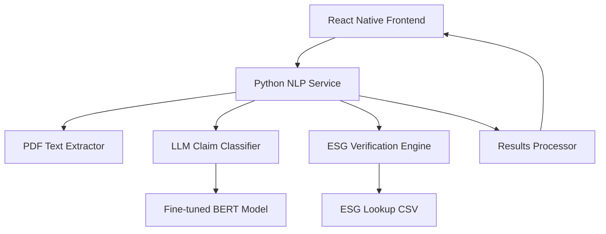

# Design Document

## Overview

The ESG Claim Verification system is a hybrid Python-React Native application that processes sustainability reports to automatically detect and verify environmental claims. The system uses a fine-tuned BERT model for claim classification and rule-based verification against a verified ESG dataset.

### Architecture Flow
1. **Frontend (React Native)**: PDF upload, results display, user interface
2. **Python Backend**: NLP processing, LLM inference, ESG verification
3. **Data Layer**: ESG lookup CSV, trained model files, processed results

## Architecture

### System Components



### Technology Stack
- **Frontend**: React Native (Expo), React Navigation
- **Backend**: Python with transformers, pandas, PyPDF2/pdfplumber
- **ML Model**: Fine-tuned BERT (BertForSequenceClassification)
- **Data**: CSV-based ESG lookup table
- **Integration**: File-based communication between Python and React Native

## Components and Interfaces

### 1. Python NLP Service (`nlp_processor.py`)

**Purpose**: Main orchestrator for the entire NLP pipeline

**Key Functions**:
```python
def process_pdf_document(pdf_path: str, company_name: str) -> dict:
    """Main processing pipeline"""
    
def extract_text_from_pdf(pdf_path: str) -> str:
    """Extract and clean text from PDF"""
    
def split_into_sentences(text: str) -> List[str]:
    """Split text into individual sentences"""
    
def classify_claims(sentences: List[str]) -> List[dict]:
    """Use LLM to classify sentences as claims/non-claims"""
    
def verify_claims(claims: List[dict], company_name: str) -> List[dict]:
    """Verify claims against ESG lookup data"""
```

**Input**: PDF file path, company name from filename
**Output**: JSON structure with detected and verified claims

### 2. LLM Claim Classifier (`claim_classifier.py`)

**Purpose**: Load and use the fine-tuned BERT model for claim detection

**Key Functions**:
```python
class ClaimClassifier:
    def __init__(self, model_path: str):
        """Load the fine-tuned BERT model"""
        
    def classify_sentence(self, sentence: str) -> dict:
        """Classify single sentence as claim/non-claim"""
        
    def batch_classify(self, sentences: List[str]) -> List[dict]:
        """Classify multiple sentences efficiently"""
```

**Model Configuration**:
- Architecture: BertForSequenceClassification
- Input: Text sentences (max 512 tokens)
- Output: Binary classification (Claim/Non-Claim) with confidence scores

### 3. ESG Verification Engine (`esg_verifier.py`)

**Purpose**: Match detected claims against verified ESG data

**Key Functions**:
```python
class ESGVerifier:
    def __init__(self, csv_path: str):
        """Load ESG lookup data"""
        
    def extract_claim_data(self, claim_text: str) -> dict:
        """Extract metrics, values, years from claim text"""
        
    def fuzzy_match_company(self, company_name: str) -> str:
        """Match company name variations"""
        
    def verify_claim(self, claim_data: dict, company_name: str) -> dict:
        """Verify claim against lookup data"""
```

**Verification Logic**:
- Extract numerical values, percentages, years from claims
- Fuzzy match company names and metric variations
- Compare against CSV data with tolerance ranges
- Categorize as: verified, questionable, unverified

### 4. React Native Integration

**Updated Services Structure**:
```
ClimateApp/services/
├── pythonBridge.js          # Interface to Python backend
├── documentProcessor.js     # Document upload and processing
├── dataService.js          # Data management (updated)
└── nlpService.js           # Legacy service (to be removed)
```

**Key Components**:
- `PythonBridge`: Execute Python scripts and handle results
- `DocumentProcessor`: Manage PDF uploads and processing workflow
- Updated `DataService`: Remove mock data, handle real results

## Data Models

### Input Data Structure
```javascript
// PDF Upload Request
{
  filePath: string,
  fileName: string,
  companyName: string, // extracted from filename
  fileSize: number
}
```

### Processing Pipeline Data
```python
# Python Processing Result
{
  "document_info": {
    "filename": str,
    "company_name": str,
    "total_sentences": int,
    "processing_time": float
  },
  "claims": [
    {
      "id": int,
      "text": str,
      "confidence": float,
      "verification_status": str,  # verified/questionable/unverified
      "extracted_data": {
        "metric": str,
        "value": float,
        "unit": str,
        "year": int
      },
      "match_details": {
        "csv_match": bool,
        "tolerance_check": bool,
        "reasoning": str
      }
    }
  ],
  "summary": {
    "total_claims": int,
    "verified": int,
    "questionable": int,
    "unverified": int
  }
}
```

### ESG Lookup Schema
```csv
company,year,metric,value,unit,source
Apple,2020,emissions_tCO2e,2126615,tons,CDP
Apple,2020,renewable_energy_percent,58.2,%,Sustainability Report
```

## Error Handling

### Python Backend Error Handling
```python
class ESGProcessingError(Exception):
    """Base exception for ESG processing errors"""
    
class ModelLoadError(ESGProcessingError):
    """Error loading the fine-tuned model"""
    
class PDFExtractionError(ESGProcessingError):
    """Error extracting text from PDF"""
    
class VerificationError(ESGProcessingError):
    """Error during claim verification"""
```

### React Native Error Handling
- Network timeouts for Python processing
- File upload validation
- Processing status monitoring
- Graceful degradation for missing data

## Testing Strategy

### Python Backend Testing
```python
# Unit Tests
test_pdf_extraction()
test_sentence_splitting()
test_claim_classification()
test_esg_verification()
test_fuzzy_matching()

# Integration Tests
test_full_pipeline()
test_error_handling()
test_performance_benchmarks()
```

### React Native Testing
```javascript
// Component Tests
test_document_upload()
test_results_display()
test_empty_states()

// Integration Tests
test_python_bridge_communication()
test_processing_workflow()
test_error_scenarios()
```

### Test Data Requirements
- Sample PDF documents with known claims
- Expected classification results
- ESG lookup test data subset
- Performance benchmarks

## Implementation Details

### Python Dependencies
```python
# requirements.txt
transformers==4.57.1
torch>=1.9.0
pandas>=1.3.0
PyPDF2>=2.0.0
pdfplumber>=0.7.0
fuzzywuzzy>=0.18.0
python-Levenshtein>=0.12.0
nltk>=3.6.0
scikit-learn>=1.0.0
```

### File Processing Workflow
1. **PDF Upload**: React Native saves file to shared directory
2. **Python Processing**: Background process handles NLP pipeline
3. **Results Storage**: JSON results saved to shared directory
4. **Frontend Update**: React Native reads results and updates UI

### Performance Considerations
- Batch processing for multiple sentences
- Model caching to avoid reloading
- Efficient CSV lookup with indexing
- Progress tracking for long documents

### Security Considerations
- File validation before processing
- Sanitized file paths
- Error message sanitization
- Resource usage limits

## Integration Points

### Python-React Native Communication
```javascript
// pythonBridge.js
export class PythonBridge {
  static async processDocument(filePath, fileName) {
    // Execute Python script with document
    // Return processing results
  }
  
  static async getProcessingStatus(jobId) {
    // Check processing status
  }
}
```

### File System Structure
```
shared/
├── uploads/           # PDF files from React Native
├── processing/        # Temporary processing files
├── results/          # JSON results for React Native
└── models/           # Cached model files
```

### Configuration Management
```python
# config.py
MODEL_PATH = "trained_llm_for_claim_classification/best_finetuned_model"
ESG_CSV_PATH = "esg_lookup_2020_2025.csv"
CONFIDENCE_THRESHOLD = 0.7
VERIFICATION_TOLERANCE = 0.1
```

This design provides a robust, scalable architecture for ESG claim verification while maintaining clear separation between the Python NLP backend and React Native frontend.